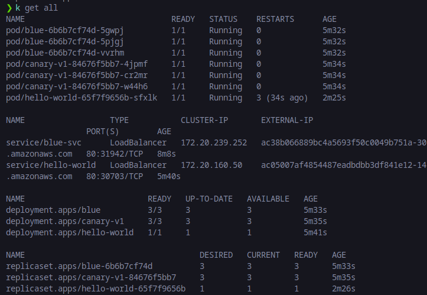
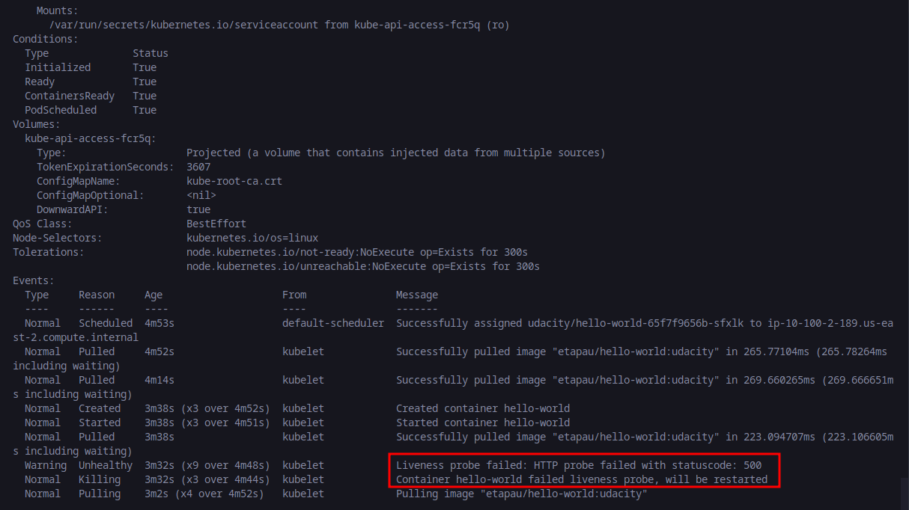
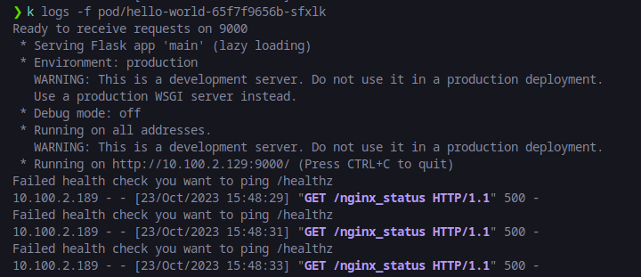
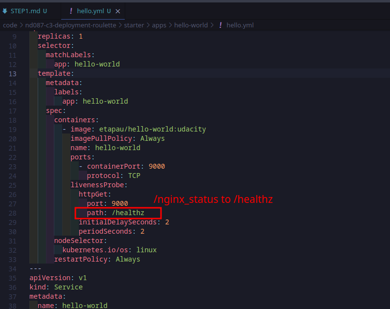
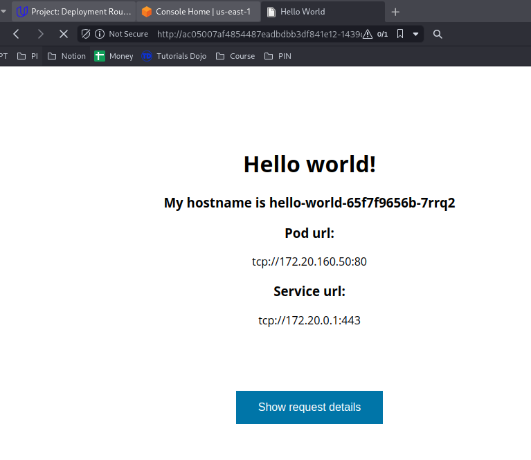
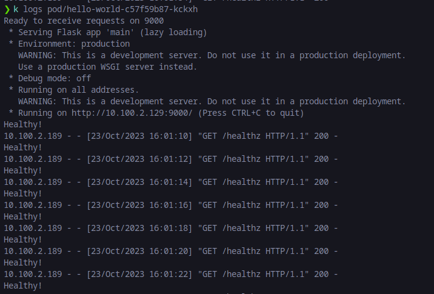

# Step 1: Deployment Troubleshooting

### Problem

The deployment hello-world can run but its pod gets restarted over and over. When inspected, that pod gets the error CrashLoopBackOff like this image:

Pod gets CrashLoopBackOff error because of failing Liveness probe check:

### Reason

The hello-world pod has livenessProbe configuration wrong (/nginx_status). This endpoint will return status 500. The right endpoint for health check status is /healthz. Here is the log of the failed pod:

### Solution

Fix livenessProbe of hello-world container to right health check endpoint to help the pod to be deployed successfully:

After fixing, the deployment is successful and the hello-world app can be accessible now:

Here is the log of hello-world application after running `kubectl logs <pod_name>`:

