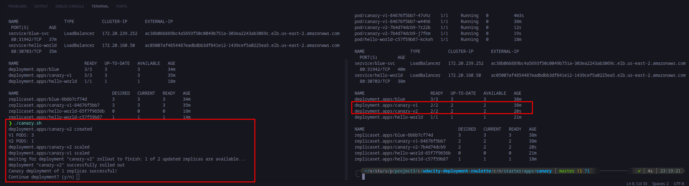
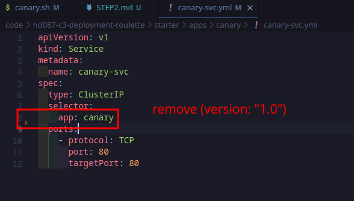
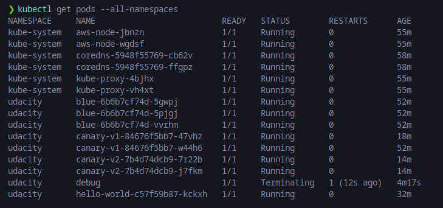

# Step 2: Canary deployments

### canary.sh shell script

[canary.sh file](../code/nd087-c3-deployment-roulette/starter/solution/canary.sh)

### Canary deploy v2 to take up 50% client requests

### Curl the service 10 times

Before doing, edit `canary-svc.yml` file to allow K8s service to reach both version of canary deployment:

Canary.txt file:

[canary.txt file](canary.txt)

### Output of command kubectl get pods --all-namespaces

