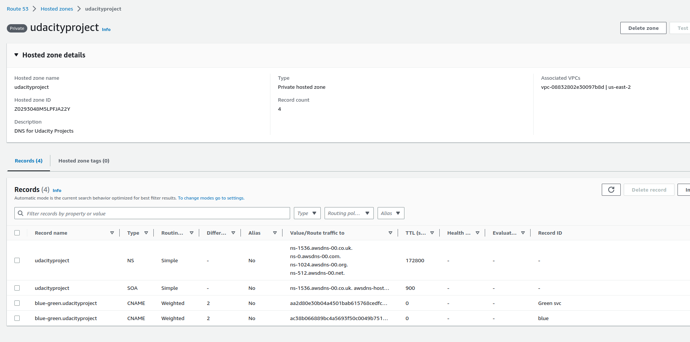
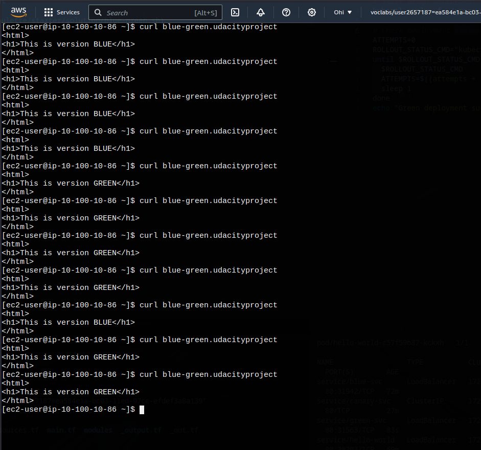
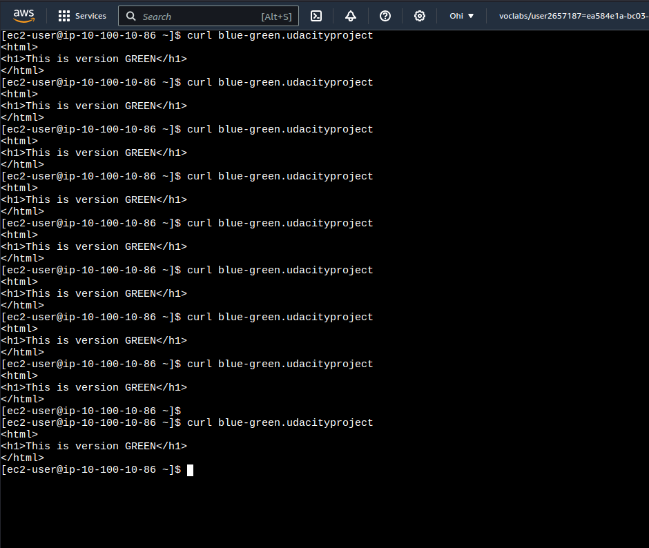

# Step 3: Blue-green deployments

### blue-green.sh script to execute green deployment

[blue-green.sh file](../code/nd087-c3-deployment-roulette/starter/solution/blue-green.sh)

### curl blue-green.udacityproject.com with both env

Setup Route53 record for Green deployment:

Screenshot green-blue:

### Failover to green environment

Screenshot green-only:

