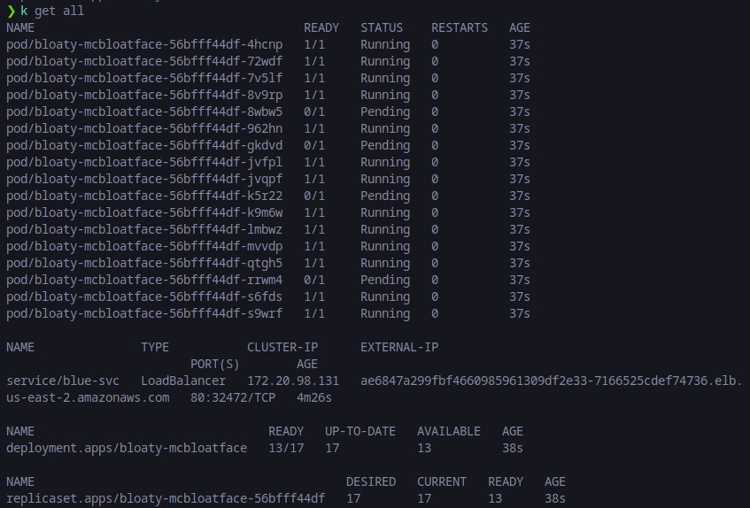
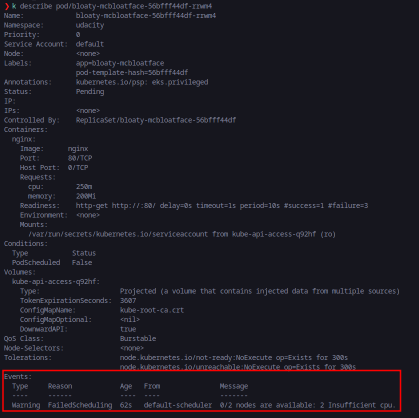
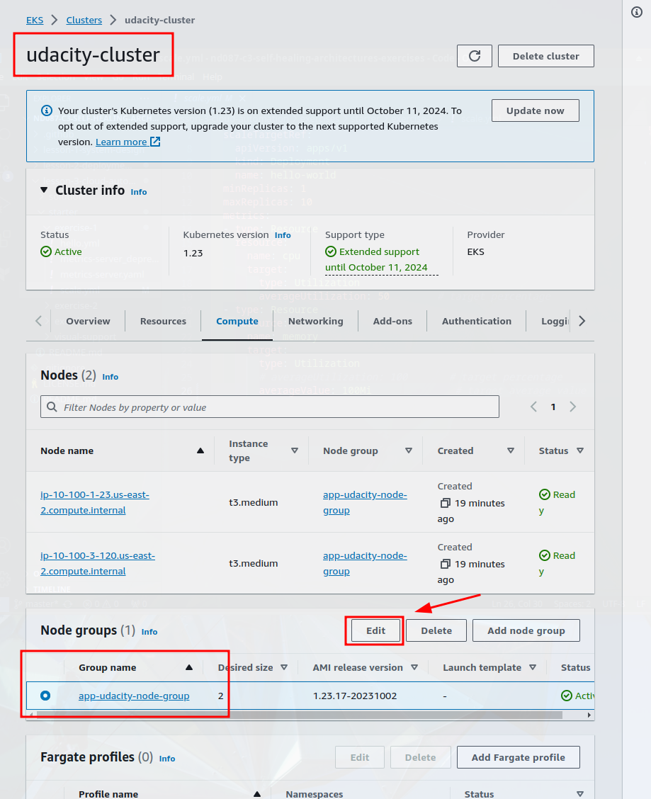
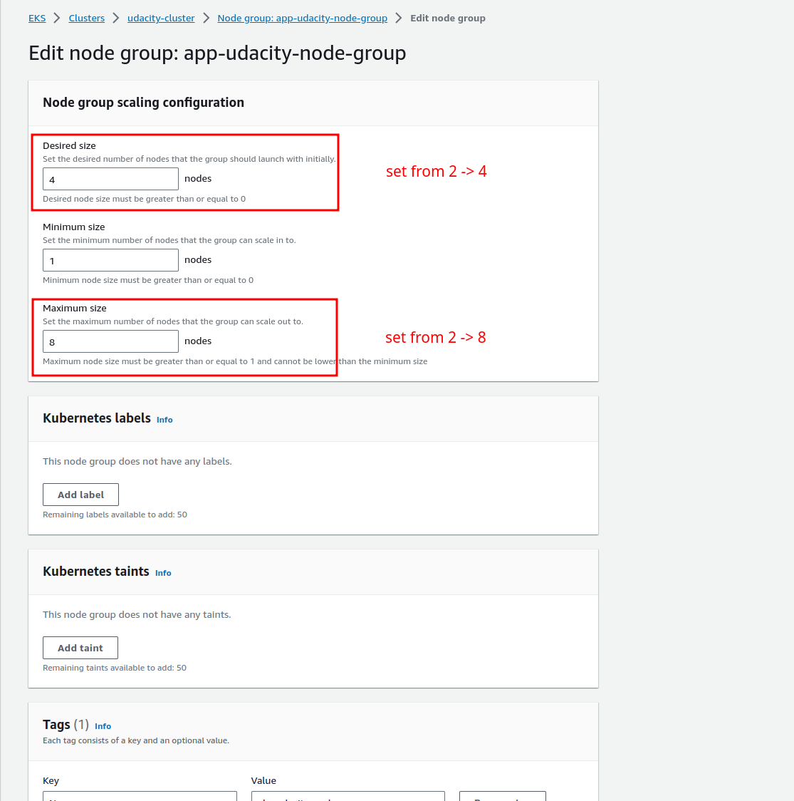

# Step 4: Node elasticity

### Bloatware deployment

Bloatware deplotment are successful. However, some of its pod are still in `pending` stage (4/17 pods).

### Reason why deployment was not successful

The reason why the deployment was not successful is that the node that the deployment is running on has insufficient resources to deploy all 17 pods (specificially cpu). Here is the logs of a pod that's still in pending stage:

### Solution

The solution is to update the number of nodes in EKS node group to increase the resources used to run application. Previously the number of nodes running is 2, now it will be increased to 4.

This solution is just a manual solution. To automate increasing node size without any human intervention, it requires ClusterAutoscaling resource.

### Deployed service

After increasing node size, all bloaty pods are in running state now. Here is the output of command `kubectl get pods --all-namespaces`:

[node-elasticity.txt](./node-elasticity.txt)
